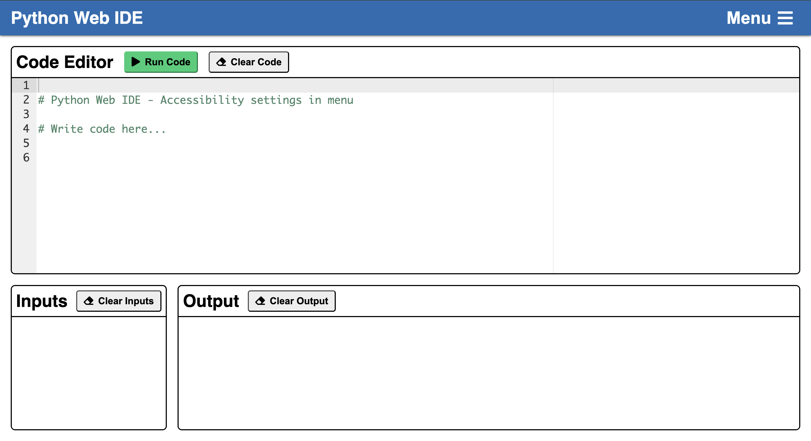
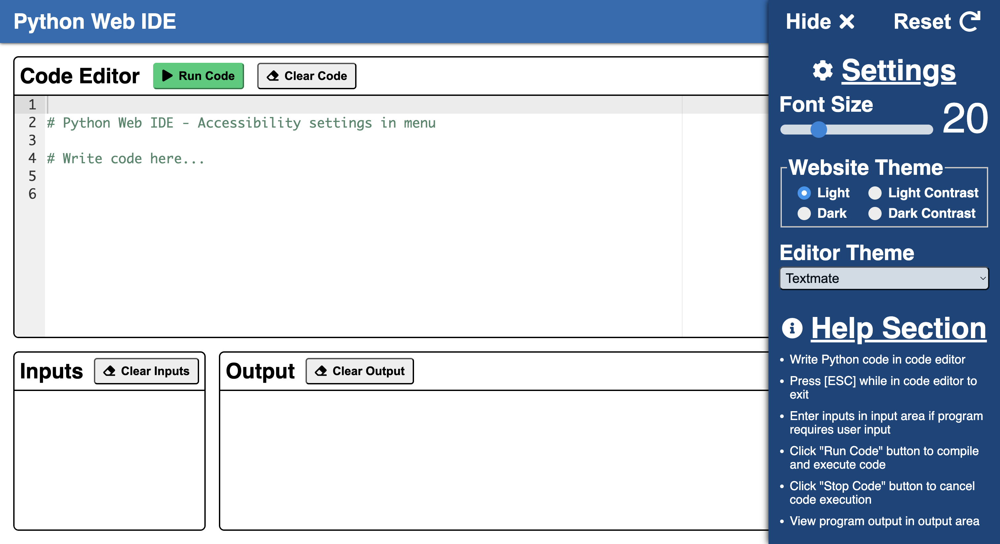

# Accessible Python Web IDE

This project is a web-based Python IDE (Integrated Development Environment) primarily designed to be accessible for blind and low-vision students learning how to code utilizing the JAWS screenreader on Windows machines.

## Installation Steps

Ensure the following dependencies are installed prior to deploying the web app.
1. Install Docker on host machine. <br>

   Follow the official Docker installation instructions for your operating system at the link below, and complete all steps listed on that page:
   - Windows: https://docs.docker.com/desktop/setup/install/windows-install/
   - Mac: https://docs.docker.com/desktop/setup/install/mac-install/
   - Linux: https://docs.docker.com/engine/install/
  
2. Clone this repository in desired location on host machine:

   ```
   git clone https://github.com/ciaranheaney/accessible-python-web-ide.git
   ```
	
## Web App Deployment and Cleanup

#### Follow the following steps to deploy the web app.
1. Build the Docker image and run the Docker container by running the following script:
	```
	./scripts/run_docker [port-number]
 	```
 
2. Visit the following link in a web browser (with correct fill-ins):<br>
    ```
    http://[host-ip-address]:[port-number]
   ```
	
#### Follow the following steps to shut down the web app.
1. Stop the Docker container and remove the Docker container and image by running the following script:
	```
	./scripts/cleanup_docker
 	```
	
## Usage Instructions

A basic overview of how to use the application as it was intended to be used for maximum accessibility. This includes various navigation and customization tools, and information about the general layout of the application.

### General Instructions

1. Write Python code in code editor section (IDE is running Python 3.8.1).
2. Enter inputs in the Input Area if necessary for the specific program.
3. Run the code by pressing the `Run Code` button or using the `Ctrl+R` keyboard shortcut.
4. Press the `Stop Code` button or use the `Ctrl+S` keyboard shortcut to cancel the code execution request.
5. View the output in the Output Area.
6. Customize the web application accessibility and appearance in the side menu (font size, website theme, and code editor theme).
7. Clear the Code Editor, Input Area, and Output Area by pressing their respective `Clear` buttons.

 ### Web App Sections
 
 * **Code Editor**: Where to write Python code
 * **Input Area**: Space to enter any inputs the written code may need
 * **Output Area**: Space where the code's output will be displayed after running
 * **Side Menu**: Clickable menu that contains the accessibility Settings and help section<br><br>

   

### Keyboard Shortcuts

| Action | Windows/Linux | macOS |
|---|---|---|
| Run Code | <kbd>Ctrl</kbd> + <kbd>R</kbd> | <kbd>Ctrl</kbd> + <kbd>R</kbd> |
| Stop Code Execution | <kbd>Ctrl</kbd> + <kbd>S</kbd> | <kbd>Ctrl</kbd> + <kbd>S</kbd> |
| Escape Code Editor | <kbd>ESC</kbd> + <kbd>ESC</kbd> | <kbd>ESC</kbd> |
| Open Menu | <kbd>Ctrl</kbd> + <kbd>M</kbd> | <kbd>Ctrl</kbd> + <kbd>M</kbd> |
| Close Menu | <kbd>ESC</kbd> | <kbd>ESC</kbd> |

**NOTE:** Additional keyboard shortcuts inherited from Ace Editor found [here](https://github.com/ajaxorg/ace/wiki/default-keyboard-shortcuts).

### Suggested JAWS Navigation Hotkeys

| Action | JAWS Shortcut |
|---|---|
| Next Heading | <kbd>H</kbd> |
| List Headings | <kbd>Insert</kbd> + <kbd>F6</kbd> |
| Next Button | <kbd>B</kbd> |
| Prior Button | <kbd>Shift</kbd> + <kbd>B</kbd> |
| List Buttons on Screen | <kbd>Ctrl</kbd> + <kbd>Insert</kbd> + <kbd>B</kbd> |
| Next Paragraph | <kbd>P</kbd> |
| List Paragraphs on Screen | <kbd>Ctrl</kbd> + <kbd>Insert</kbd> + <kbd>P</kbd> |
| Say Line | <kbd>INSERT</kbd> + <kbd>UP ARROW</kbd> |
| Say Prior Line | <kbd>UP ARROW</kbd> |
| Say Next Line | <kbd>DOWN ARROW</kbd> |

**NOTE:** All JAWS Hotkeys can be found [here](https://www.freedomscientific.com/training/jaws/hotkeys/).

### Accessibility Settings

* **Font Size** of the code editor, input, and output areas
* **Website Theme** (Options: Light, Dark, Light Contrast, and Dark Contrast)
* **Code Editor Themes** (Options provided by Ace Editor)<br><br>

  

## Project Structure
```
.
├── app
│   ├── app.py
│   ├── static
│   │   ├── ace [54 entries exceeds filelimit, not opening dir]
│   │   ├── script.js
│   │   └── styles.css
│   └── templates
│       └── index.html
├── images
│   ├── webide-screenshot.png
│   └── webide-sidemenu-screenshot.png
├── scripts
│   ├── cleanup_docker
│   └── run_docker
├── Dockerfile
├── README.md
└── requirements.txt

4 directories, 9 files
```

## Credits

This project was completed as part of ongoing efforts to make computer science education more inclusive and was made possible thanks to the support and guidance of the faculty and resources within the University of Notre Dame’s Computer Science and Engineering Department.

<pre>
<strong>Project Author:</strong>
  Ciaran Heaney
  Computer Science
  University of Notre Dame
</pre>

<pre>
<strong>Faculty Advisor:</strong>
  Professor Collin McMillan
  Computer Science and Engineering Department
  University of Notre Dame
</pre>
